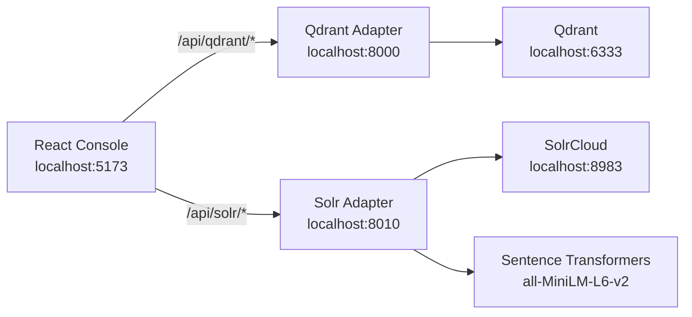

<div align="center">

# PolyEngine Console

**One local control plane for vector databases and search engines.**

Operate Qdrant, explore Solr vector relevance, and keep each engine isolated behind a dedicated API adapter.


</div>


PolyEngine Console is a modular administration workspace for local search infrastructure. The default screen is an engine health overview rather than an engine-specific page. Qdrant and Solr keep separate routes, query caches, health checks, and FastAPI processes, so one unavailable engine never blocks the other.

## Highlights

| Area | What it provides |
| --- | --- |
| **Unified workspace** | Engine overview, grouped navigation, live health indicators, responsive desktop/mobile shell, and isolated failure states. |
| **Qdrant operations** | Collections, dense/named/sparse vectors, payload indexes, points, aliases, snapshots, optimization activity, cluster telemetry, and a guarded REST console. |
| **Solr vector search** | Plain-English query embeddings, semantic and hybrid retrieval, explicit topK, multi-vector comparison and fusion, query-vector inspection, diagnostics, and relevance inspection. |
| **Solr ingestion** | JSON, JSONL, and CSV uploads; independent source-text mappings for every vector field; batched embeddings; progress, cancellation, paginated error inspection, failed-row retries, and CSV exports. |
| **Local-first security** | API keys and credentials stay in backend-only `.env` files. The browser communicates only with namespaced local adapters. |
| **Extensible foundation** | An engine registry and namespaced module layout are ready for future Elasticsearch and Dgraph adapters. |

## Interface

### Solr vector search

Write a plain-English query and let the local embedding adapter build the Solr KNN request. The workbench keeps topK, vector-field selection, semantic/hybrid mode, multi-field comparison and fusion, exact query-vector inspection, score diagnostics, timing, relevance judgments, and exports in one place.


### Qdrant operations

Scan collection health, point and index counts, dense and sparse vector spaces, optimization activity, and lifecycle actions before drilling into vectors, payload indexes, points, aliases, snapshots, or cluster placement.


Screenshots use deterministic synthetic sample data and successful API-contract fixtures; they contain no production data. At runtime, each engine still has an isolated error state, so a stopped Qdrant instance does not block Solr workflows and vice versa.

## Architecture



The React application owns navigation and presentation only. Each Python adapter owns upstream credentials, response normalization, connection pooling, and engine-specific behavior.

## Repository Layout

```text
apps/
  console/              React, TypeScript, Vite, Ant Design, TanStack Query
services/
  qdrant-api/           FastAPI adapter for Qdrant
  solr-api/             FastAPI adapter for Solr and the embedding model
samples/
  solr/                 500 synthetic documents and indexing utilities
docs/
  images/               README screenshots
  solr-vector.md        Solr vector-search behavior and compatibility
compose.solr.yml        Optional local SolrCloud service
```

## Quick Start

### Prerequisites

- Node.js 20 or newer
- Python 3.11 or newer
- Qdrant at `http://localhost:6333`
- SolrCloud at `http://localhost:8983/solr`
- Network access the first time the embedding model is downloaded

Clone the repository and install dependencies:

```bash
git clone https://github.com/ZitionGuo/polyengine-console.git
cd polyengine-console

python3 -m venv .venv
.venv/bin/python -m pip install -r services/qdrant-api/requirements.txt
.venv/bin/python -m pip install -r services/solr-api/requirements.txt

cd apps/console
npm install
cd ../..
```

Start all three development processes from the repository root:

```bash
./scripts/dev.sh
```

Open [http://localhost:5173](http://localhost:5173). Press `Ctrl+C` once to stop the console and both API adapters.

The script expects Qdrant and Solr themselves to be running at the configured URLs. It does not start, stop, or modify either database.

### Start services separately

Use separate terminals when debugging an individual adapter.

#### Qdrant adapter

```bash
cd services/qdrant-api
cp .env.example .env
../../.venv/bin/python -m uvicorn app.main:app \
  --reload --host 127.0.0.1 --port 8000
```

#### Solr adapter

```bash
cd services/solr-api
cp .env.example .env
../../.venv/bin/python -m uvicorn app.main:app \
  --reload --host 127.0.0.1 --port 8010
```

#### React console

```bash
cd apps/console
npm run dev
```

Vite forwards `/api/qdrant/*` to port `8000` and `/api/solr/*` to port `8010`. Qdrant and Solr themselves remain independent local services.

### Optional local SolrCloud

```bash
docker compose -f compose.solr.yml up -d
```

## Routes

| Route | Module |
| --- | --- |
| `/` | Engine overview |
| `/qdrant/collections` | Qdrant collections and collection details |
| `/qdrant/aliases` | Qdrant alias management |
| `/qdrant/cluster` | Cluster, telemetry, shards, and storage snapshots |
| `/qdrant/rest` | Guarded Qdrant REST console |
| `/solr/collections` | Solr schema and vector-field readiness |
| `/solr/search` | Semantic, hybrid, comparison, and fusion search |
| `/solr/ingest` | Upload and background embedding jobs |

Legacy `/collections`, `/aliases`, `/cluster`, `/rest`, `/search`, and `/ingest` paths redirect to their namespaced replacements.

## Configuration

Real credentials belong only in local `.env` files. Those files are ignored by Git; commit only `.env.example`.

### Qdrant adapter

File: `services/qdrant-api/.env`

| Variable | Default | Description |
| --- | --- | --- |
| `QDRANT_URL` | `http://localhost:6333` | Qdrant REST endpoint |
| `QDRANT_API_KEY` | empty | Optional `api-key` value sent upstream |
| `CORS_ORIGINS` | localhost console origins | Allowed browser origins |

### Solr adapter

File: `services/solr-api/.env`

| Variable | Default | Description |
| --- | --- | --- |
| `SOLR_URL` | `http://localhost:8983/solr` | Solr base endpoint |
| `SOLR_USERNAME` | empty | Optional Basic Auth username |
| `SOLR_PASSWORD` | empty | Optional Basic Auth password |
| `EMBEDDING_MODEL` | `sentence-transformers/all-MiniLM-L6-v2` | English embedding model |
| `EMBEDDING_DIMENSION` | `384` | Required Solr vector dimension |
| `SOLR_READ_TIMEOUT_SECONDS` | `30` | Upstream response timeout |
| `MAX_UPLOAD_MB` | `100` | Ingestion upload limit |
| `INGEST_BATCH_SIZE` | `64` | Default embedding/indexing batch size |

See [`services/solr-api/.env.example`](services/solr-api/.env.example) for cache, timeout, and ingestion settings.

## Solr Demo Dataset

[`samples/solr/solr_vector_demo_500.jsonl`](samples/solr/solr_vector_demo_500.jsonl) contains 500 deterministic synthetic English operations guides.

Regenerate the file:

```bash
.venv/bin/python samples/solr/generate_demo_data.py
```

After creating a Solr collection with compatible `embedding` and `embedding_title` 384-dimensional `DenseVectorField` fields, index both vectors:

```bash
.venv/bin/python samples/solr/index_multi_vector_demo.py
```

The indexing script loads the embedding model from the local Hugging Face cache.

## Development

Run all automated checks:

```bash
cd services/qdrant-api
../../.venv/bin/python -m pytest

cd ../solr-api
../../.venv/bin/python -m pytest

cd ../../apps/console
npm run test
npm run build
```

Current coverage includes Qdrant alias actions, collection/index workflows, snapshots, point operations, REST proxy safeguards, Solr embedding and ingestion behavior, semantic/hybrid/fusion payloads, timeout and cancellation behavior, engine routing, legacy redirects, and single-engine failure isolation.

## Troubleshooting

### An engine shows `Unavailable`

Check the adapter first:

```bash
curl -i http://localhost:5173/api/qdrant/health
curl -i http://localhost:5173/api/solr/health
```

A `503` with a normalized `detail` body means the adapter is running but its upstream engine cannot be reached. Confirm Qdrant on port `6333` or Solr on port `8983`.

### The Solr model is not loaded

Use **Load model** from Overview, or call:

```bash
curl -X POST http://localhost:5173/api/solr/model/load
```

The first load may download model files. Later loads use the local cache.

### A Solr vector field is incompatible

The field must be a `DenseVectorField` using `FLOAT32`, and its dimension must match `EMBEDDING_DIMENSION`. The default model requires 384 dimensions.

### A moved virtual environment no longer starts scripts

Virtual-environment console scripts contain absolute shebang paths. Use `.venv/bin/python -m <module>` as shown above, or recreate `.venv` after moving the repository.

## Security Notes

- Qdrant API keys and Solr credentials are injected by Python adapters and never returned to the browser.
- The Qdrant REST proxy accepts relative Qdrant paths only; it cannot proxy arbitrary external URLs.
- Mutating REST Console requests require confirmation.
- `.env`, virtual environments, model caches, uploads, build output, and dependency folders are excluded from Git.
- The included Solr dataset is synthetic and contains no personal or production data.

## Roadmap

- Elasticsearch search and index operations
- Dgraph schema and graph exploration
- Shared connection profiles for multiple instances per engine
- Optional packaged local development runtime

Contributions can follow the existing engine registry, namespaced frontend module, and independent FastAPI adapter pattern.
